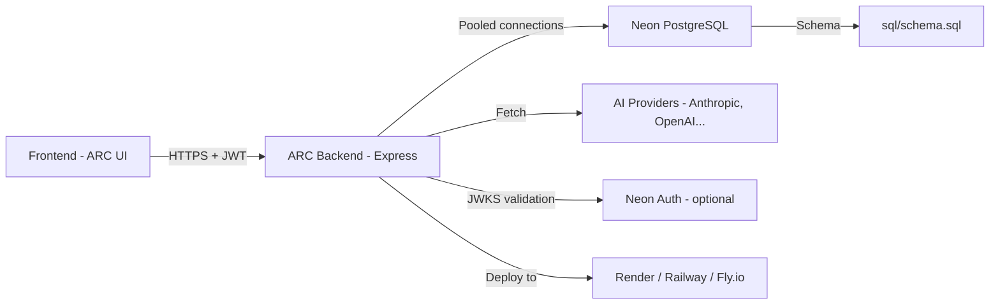

<h1 align="center">
   
  ARC Backend
</h1>

  <strong>Multi‑provider chat API — stream AI completions, manage conversations, and own your data.</strong> 
  Node.js · Express · PostgreSQL (Neon) · SSE · JWT · Neon Auth

  
  
  
  
  
  
  

---

## Why ARC Backend?

The [ARC frontend](https://github.com/rozengoza/claude-chat-interface-make-chats-with-your-apikey) gives you a clean chat UI, but **conversation persistence, multi‑user support, and provider abstraction need a backend**. That’s where this API comes in.

ARC Backend is the fast, stateless Node.js server that:
- **Persists your chats** in a Neon PostgreSQL database, so you never lose context.
- **Streams completions** from multiple AI providers (Anthropic, OpenAI, etc.) using Server‑Sent Events.
- **Secures your API keys** — keys live in memory on the server only for the duration of a request, never logged or stored.
- **Scales for zero cost** — deploy on any free‑tier platform (Fly.io, Render, Railway) and only pay for the database and AI tokens.

> 🧠 **You bring the API keys, we handle the rest.**  
> The backend proxies AI requests, adds usage limits, and keeps your conversation history safe.

---

## Architecture at a Glance

Every component is documented in this README — from local development to production deployment.

---

## Key Features

| Feature | Description |
| --- | --- |
| 🔐 **Two Auth Modes** | Local JWT (bcrypt) or Neon Auth (RS256, OAuth ready). Choose what fits your stack. |
| 💬 **Chat Management** | Full CRUD for chats, each with a message history. Each user sees only their own data. |
| ⚡ **SSE Streaming** | Real‑time token‑by‑token completion streams directly to the frontend. |
| 🤖 **Provider Adapter Layer** | One unified endpoint, multiple AI providers. Easily add new ones without touching routes. |
| 🛡️ **API Key Proxy** | User API keys never touch the database; they're passed in the request and discarded. |
| 📊 **Usage Limits** | Per‑user daily rate limiting, logged to `rate_limit_log`. Prevents free‑tier abuse. |
| 🚀 **Zero‑Config Deploys** | Ready‑to‑use `render.yaml`, `railway.toml`, `fly.toml`, and `Dockerfile`. |
| 🧪 **Health & Models** | Public `/health` and `/models` endpoints for quick status checks. |

---
